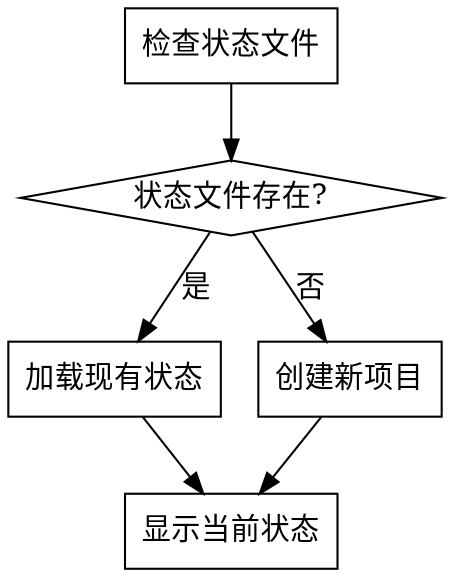
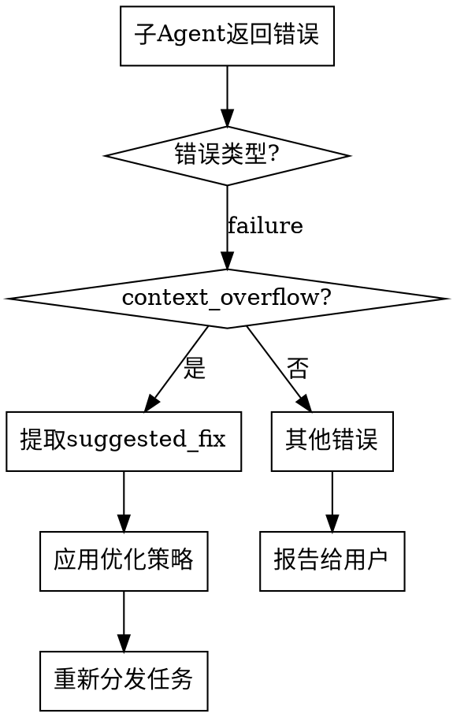

# DSH 环境适配（必读）

本工作流运行在 DeepSeek Harness（DSH）上，下文所有机制约定如下：

- **交互通道**：`ask_user_question`（对应源工作流的 AskUserQuestion）。所有决策型确认、门禁结果展示、进度面板、审查汇总必须通过它呈现；提供结构化选项（继续/回退到指定阶段/查看已有产出/保存并退出）。
- **市场数据**：`web_search`（对应 WebSearch）。平台政策/市场数据实时检索，禁止捏造；失败按降级协议：重试 → 明确标注的 LLM 推断（禁具体数值）→ 用户确认跳过。
- **子代理**：`subagent` / `subagent_fork`（provider: spawn / fork，`backgroundMode: continuable`）。启动协议保持「三层约束注入」（Agent 定义路径 + SKILL 路径 + 工作文件绝对路径）；子代理硬边界不变：不交互、不写 workflow-state、不做最终决策、不相互通信。
- **novel_* 工具集（dsh-novel-writing 插件提供，门禁代码化）**：
  - `novel_chapter_write`：保存正文前**强制**执行看护硬门禁（场景覆盖率=100%、禁止项零命中），未通过且未 `force` 则拒绝保存并返回明细——原来的「硬门槛=阻断」现在由代码执行，不再依赖自觉；
  - `novel_gate_check`：生成/修订正文时可随时预检（不保存）；
  - `novel_review_submit`：审查结论必须带 ≥2 条含原文引用的具体发现，<100 分 = 未通过；
  - `novel_data_ingest`：数据入库即返回信号（完读率低/章节流失/追读下降/收藏停滞/收益下滑）与建议行动；
  - `novel_publish`：先校验 `release_allowed`，再按平台配置导出/执行命令；
  - `novel_requests` / `novel_request_done`：用户从「小说工作台」提交的优化/审查/发布/数据请求队列；
  - `novel_list` / `novel_status` / `novel_state_update` / `novel_chapter_read`：书目与状态。
  - 注意：这些工具仅在本预设会话可见；正文/大纲等文件本体仍用 fs 工具读写。
- **小说工作台（浏览器）**：会话顶部「小说」标签 = 工作台（章节列表/阅读/编辑/保存、工作流进度与门禁、数据录入与信号、发布面板、请求队列）；侧栏「小说 HUD」浮动实时状态。工作台提交请求 → 你用 `novel_requests` 处理 → `novel_request_done` 收口。
- **workspace 约定**：工作区默认 `~/novels/<小说id>/novel-project/`（00-17 目录结构与源工作流完全一致，可直接续用旧项目）；`workflow-state.json` schema 与源工作流 v4.2 兼容（增量更新）。

---

<SUBAGENT-STOP>
If you were dispatched as a subagent to execute a specific task, skip this skill.
</SUBAGENT-STOP>

# Using Writing Workflow

AI辅助小说创作工作流的主入口。管理整个创作流程，协调各阶段skill的执行。

## 触发条件

用户请求开始小说创作工作流时触发。关键词包括：
- "开始小说创作"
- "写作工作流"
- "创作小说"
- "writing-workflow"

## 交互架构

### 三层角色模型

```
┌──────────────────────────────────────────────────────┐
│                      用 户                            │
│          (决策者：选择/确认/打断/回退/跳过/暂停)         │
└──────────────────┬───────────────────────────────────┘
                   │ ask_user_question（唯一交互通道）
                   │ 用户感知：进度面板、方案选项、审查结果、门禁状态
┌──────────────────┴───────────────────────────────────┐
│                 Coordinator（主 Agent）                │
│                                                       │
│  你是唯一的用户界面。你的核心职责：                       │
│  • 展示进度 — 每个阶段切换时更新进度面板                 │
│  • 呈现选项 — 决策型阶段的方案由你呈现给用户选择          │
│  • 汇总审查 — 审查组报告由你汇总后展示给用户              │
│  • 传达门禁 — 门禁检查结果由你告知用户                   │
│  • 调度 Subagent — 你决定启动哪个、传什么参数             │
│  • 管理状态 — 你是唯一写入 workflow-state 的角色         │
│  • 处理降级 — 工具不可用时由你向用户确认降级方式          │
│  • 响应打断 — 用户随时可以说"暂停""回退""跳过"            │
└──────┬──────────┬──────────┬──────────┬──────────────┘
       │          │          │          │
       ▼          ▼          ▼          ▼
   ┌──────┐  ┌──────┐  ┌──────┐  ┌──────┐
   │Sub-1 │  │Sub-2 │  │Sub-3 │  │Sub-4 │  ...
   └──────┘  └──────┘  └──────┘  └──────┘
    生产者（生成方案/执行任务/输出审查报告）
    不与用户交互  ·  不更新 workflow-state  ·  不相互通信
```

### Subagent 硬边界

| 可以做的 | 不可以做的 |
|---------|-----------|
| 读取工作文件 | **与用户交互**（无 ask_user_question 能力） |
| 使用 web_search 获取数据 | **修改 workflow-state** |
| 生成输出文件 | **做最终决策**（决策型阶段只出方案） |
| 返回结构化结果给 Coordinator | **与其他 Subagent 直接通信** |
| 执行审查并输出报告 | **拒绝 Coordinator 分配的任务** |

### Coordinator 的 4 种产出路由

| 产出类型 | 来源 | 路由方式 | 用户感知 |
|---------|------|---------|---------|
| **决策型方案** | market-analyst, creation-strategist, novel-architect | Subagent 返回方案 → Coord 用 ask_user_question 呈现选项列表 → 用户选择 → Coord 确认后路由给执行型 Subagent | 看到选项+推荐+风险，做出选择 |
| **执行型产出** | chapter-designer, content-writer, launch-strategist 等 | Subagent 返回文件 → Coord 执行 F1-F4 门禁检查 → ask_user_question 展示门禁结果 → 用户确认 | 看到门禁结果，决定通过/重做/回退 |
| **审查型报告** | continuity-reviewer, character-world-reviewer, plot-logic-reviewer, commercial-editor, engagement-reviewer, ai-compliance-officer | 6 报告收集 → Coord 汇总为统一审查面板 → ask_user_question 展示 → 用户决定通过/修正 | 看到六项审查结果+总分+问题列表 |

### 审查质量门禁（防放水机制）

Coordinator 汇总审查报告后，**必须**逐份检查审查质量。零假设：Agent 会偷懒、输出空洞结论。

**每份审查报告的强制最低标准**：

```
□ 是否包含至少 2 个具体发现？（"通过，无问题"=无效审查，必须驳回重审）
□ 每个发现是否引用了正文原文？（无引用=无证据=无效）
□ 每个发现是否标注了严重程度？（阻断/警告/建议）
□ 是否明确标注了"通过/不通过"判定？

4/4 全部满足 = 审查有效。任一不满足 = 驳回该审查 Agent 重新审查。
```

Coordinator 在展示给用户前执行此门禁。被驳回的审查必须用更严格的 prompt 重新启动该 Agent："你的上一次审查因缺乏具体发现被驳回。请至少找到 3 个具体问题（含正文引用），即使它们很微小。'通过，无问题'不是可接受的审查结论。"
| **参考型产出** | competitor-analyst, data-analyst | Subagent 返回分析 → Coord 写入文件并通知用户摘要 | 看到摘要，无确认步骤 |

### 用户随时可介入的时机

每个阶段切换时，Coordinator 展示进度面板。用户可在以下时机干预：

1. **阶段开始前** — 查看进度面板，选择"跳到指定阶段"/"回退到X阶段"/"暂停退出"
2. **方案确认时**（决策型阶段）— 选择/调整/拒绝方案
3. **门禁结果展示时**（执行型阶段）— 确认通过/要求重做/手动修复/回退
4. **审查汇总展示时** — 通过/逐项修正/强制重写/回退到细纲或大纲
5. **工具降级确认时** — 选择重试/LLM推断/跳过

进度面板模板：

```
ask_user_question：
━━━━━━━━━━━━━━━━━━━━━━━━━━━━━━
📋 《[书名]》创作工作流
━━━━━━━━━━━━━━━━━━━━━━━━━━━━━━
 [状态图标] 0.作品类型     [完成状态]
 [状态图标] 1.平台调研     [完成状态]
 [状态图标] 2.题材选择     [完成状态]
 ...
 [状态图标] N.[当前阶段]   [进行中/待确认]
━━━━━━━━━━━━━━━━━━━━━━━━━━━━━━
已完成：X/16 阶段 | 已产出：[文件数] 个文件 | 预估剩余时间：约 [N] 分钟
可操作：继续 / 回退到指定阶段 / 查看已有产出 / 保存并退出
━━━━━━━━━━━━━━━━━━━━━━━━━━━━━━
各阶段预估耗时（参考）：调研类2-5分钟 / 大纲类5-15分钟 / 细纲类5-10分钟 / 正文类3-5分钟/章 / 审查类1-3分钟/章
预估API费用参考：单章（生成+审查）约0.1-0.3美元 / 整本200章约20-60美元（仅为方向性参考，实际取决于模型定价和上下文长度）
```

状态图标：✅已完成  🔄进行中  ⬜待执行  ⚠️需修正  🚫已阻断  ⏭️已跳过

## 跨书学习机制

为让作者在每本书中持续进步，工作流维护一份跨项目的 `author-playbook.json`，存放在作者的**工作根目录**下（与各 `novel-project/` 平级）。

### author-playbook.json 结构

```json
{
  "author": "作者笔名",
  "created": "首次使用日期",
  "updated": "最近更新日期",
  "projects": [
    {
      "id": "项目编号",
      "title": "书名",
      "platform": "发布平台",
      "genre": "题材",
      "status": "已完成/连载中/已弃书",
      "word_count": 2000000,
      "quality_scores": {
        "avg_chapter_score": 72,
        "best_chapter_score": 88,
        "worst_chapter_score": 55
      },
      "revenue": {
        "monthly_avg": "月均收入范围",
        "total": "总收入范围",
        "source": "订阅/广告/打赏"
      },
      "lessons": {
        "what_worked": ["法医职业设定吸引了跨界读者", "单元案+长线的双轨叙事留存好"],
        "what_didnt_work": ["第2卷中期节奏拖沓导致追读下降", "开篇类型信号太晚"],
        "would_do_differently": ["开篇前500字就植入超凡暗示", "第一卷缩短到25万字"]
      }
    }
  ],
  "patterns": {
    "best_genres": ["都市修真融合的跨界读者最多"],
    "best_platforms": ["起点付费追读指标最适合作者风格"],
    "recommended_chapter_length": "2500-3000字/章",
    "effective_hook_types": ["悬念型章末钩子的留存最高"],
    "genre_specific_lessons": {
      "玄幻": {"best_word_count": 3000000, "best_chapter_length": "2500-3000", "best_platform": "起点"},
      "都市": {"best_word_count": 2000000, "best_chapter_length": "2000-2500", "best_platform": "番茄"}
    },
    "platform_specific_lessons": {
      "起点": {"best_genre": "玄幻", "best_posting_time": "11:30+21:00"},
      "番茄": {"best_genre": "都市脑洞", "critical_chapters": "前10章"}
    },
    "emotional_signature_performance": {
      "最佳主情感": "爽感驱动",
      "最佳辅助情感": ["悬念", "温情"],
      "最弱情感体验": "悲剧美感（推荐率低）"
    }
  }
}
```

### 更新时机

- **项目完成时**：`monetization_strategy` 阶段结束后，Coordinator 汇总本书的质量评分和收益数据，写入 `author-playbook.json`
- **项目弃书时**：止损决策触发后，Coordinator 记录弃书原因和教训
- **每卷完成时**：可选更新质量评分趋势

### 跨书学习的应用

启动新项目时，Coordinator 读取 `author-playbook.json`（若存在），在以下阶段注入历史经验：

**题材选择阶段**（market-analyst 启动时）：
- 将 playbook 中 `patterns.best_genres` 和 `patterns.best_platforms` 作为个性化推荐的权重因子
- 提示："基于你的历史数据，[题材X]在[平台Y]上表现最佳"

**创作规划阶段**（creation-strategist 启动时）：
- 将 playbook 中 `patterns.recommended_chapter_length` 和 `patterns.effective_hook_types` 作为默认推荐
- 提示："你的历史最佳章节长度为[X]字，最有效的钩子类型是[Y]"

**质量审查阶段**（审查结果展示时）：
- 将当前评分与 `projects[].quality_scores` 历史数据对比
- 提示："当前开篇得分[X]，你的历史最佳开篇得分[Y]——这是你目前得分最[高/低]的开篇"

**项目完成/弃书时**（monetization_strategy 或止损决策后）：
- Coordinator 汇总本书数据，更新 `author-playbook.json`
- 记录 what_worked / what_didnt_work / would_do_differently

## 工作流状态管理

工作流状态保存在 `novel-project/workflow-state.json`：

```json
{
  "current_stage": "work_type_selection",
  "completed_stages": [],
  "project_info": {
    "work_type": null,
    "platform": null,
    "genre": null,
    "title": null
  },
  "files": {},
  "guardrails": {
    "continuity_mode": "strict",
    "latest_passed_chapter": 0,
    "latest_ai_path": null,
    "release_allowed": true,
    "monetization_allowed": true,
    "latest_drift_score": null,
    "latest_context_card": null,
    "latest_continuity_ledger": "novel-project/17-continuity/continuity-ledger.md"
  },
  "statistics": {
    "total_chapters": 0,
    "total_words": 0,
    "last_updated": null
  }
}
```

## 阶段定义

| 阶段ID | 阶段名称 | 对应Skill | 说明 |
|--------|----------|-----------|------|
| work_type_selection | 作品类型选择 | work-type-selection | 选择适合的作品类型 |
| platform_research | 平台调研 | platform-research | 调研平台数据、签约政策 |
| competitor_analysis | 竞品分析 | competitor-analysis | 深度拆解同赛道头部作品 |
| genre_selection | 题材选择 | genre-selection | 选择创作题材 |
| novel_confirmation | 作品确认 | novel-confirmation | 确定作品基本信息 |
| creation_planning | 创作规划 | creation-planning | 制定创作计划 |
| outline_writing | 大纲生成 | outline-writing | 生成世界观和大纲 |
| outline_review | 大纲审查 | outline-review | 地基审查——Bible完整性+人物世界观自洽+盈利适配（🔒质量关键） |
| chapter_outline | 章节细纲 | chapter-outline | 生成章节细纲 |
| chapter_outline_review | 细纲审查 | chapter-outline-review | 施工图审查——大纲一致性+平台算法适配+阅读节奏预判（🔒质量关键） |
| content_generation | 正文生成 | content-generation | 生成正文内容（含平台算法适配） |
| human_ai_collaboration | AI合规处理 | human-ai-collaboration | 人机协作流程，确保内容过审 |
| quality_review | 质量审查 | continuity-check + character-world-check + plot-logic-check + commercial-check + engagement-check + ai-compliance-check | 6 个独立 agent+SKILL 对并行审查 |
| launch_strategy | 上架发布 | launch-strategy | 存稿管理、签约、首秀准备 |
| monetization_strategy | 变现策略 | monetization-strategy | VIP/付费卡点/收益优化 |
| opening_optimization | 开篇优化 | opening-optimization | 黄金三章优化（可选） |
| novel_style_learning | 网文风格学习 | novel-style-learning | 学习网文风格（可选） |
| data_monitoring | 数据监控 | data-monitoring | 监控运营数据+数据→内容闭环（发布后） |
| reader_interaction | 读者互动 | reader-interaction | 管理读者关系（发布后） |

## Agent Team 调度

本工作流采用 **Agent Team 模式**，不同阶段由不同职能的专业 Agent 执行，避免同一 LLM 创作又审查自己的内容。

### 团队结构

| 团队 | Agent | 负责阶段 | Agent 文件 |
|------|-------|---------|-----------|
| 市场调研组 | 市场分析师 | platform_research, genre_selection | `agents/market-analyst.md` |
| | 竞品拆解专家 | competitor_analysis | `agents/competitor-analyst.md` |
| 策划创作组 | 创作策略顾问 | work_type_selection, novel_confirmation, creation_planning | `agents/creation-strategist.md` |
| | 小说架构师 | outline_writing | `agents/novel-architect.md` |
| 内容生产组 | 章节设计师 | chapter_outline | `agents/chapter-designer.md` |
| 地基审查组 | 大纲审查员×3 | outline_review | continuity-reviewer + character-world-reviewer + commercial-editor |
| | 细纲审查员×3 | chapter_outline_review | continuity-reviewer + commercial-editor + engagement-reviewer |
| | 内容写作者 | content_generation | `agents/content-writer.md` |
| 审查组 | 连续性审查员 | 连续性硬门槛 + ledger 验证 | `agents/continuity-reviewer.md` |
| | 人物世界观审查员 | 人物一致性 + 世界观合规 | `agents/character-world-reviewer.md` |
| | 情节逻辑审查员 | 因果链 + 伏笔 + 冲突升级 | `agents/plot-logic-reviewer.md` |
| | 商业编辑 | 平台适配 + 付费设计 + 文学质量 | `agents/commercial-editor.md` |
| | 阅读体验审查员 | 情感体验 + 期待感 + 代入感 | `agents/engagement-reviewer.md` |
| | AI合规官 | human_ai_collaboration | `agents/ai-compliance-officer.md` |
| 运营组 | 发布策略师 | launch_strategy | `agents/launch-strategist.md` |
| | 变现顾问 | monetization_strategy | `agents/monetization-advisor.md` |
| | 数据运营分析师 | data_monitoring, reader_interaction | `agents/data-analyst.md` |

### 调度规则

1. **创作者与审查者绝对分离**：内容写作者完成正文后，必须由审查组的独立 Agent 进行审查
2. **审查组并行执行**：连续性审查员、人物世界观审查员、情节逻辑审查员、商业编辑可并行启动
3. **每个 Agent 使用独立 subagent**：`subagent` 工具启动，加载对应的 agent 定义文件
4. **Agent 定义优先于 SKILL**：Agent 文件定义"谁来做、怎么做"，SKILL 文件定义"做什么标准"
5. **Coordinator 不替代 Agent**：using-writing-workflow 只负责调度，不亲自执行任何阶段的内容生成或审查

每个阶段启动时，Coordinator 使用 `subagent` 工具启动独立的 subagent，传入以下标准启动模板。

## 两阶段执行协议（防绕行 ask_user_question）

Subagent 不能直接调用 ask_user_question。为保证用户决策权，**决策型阶段**必须拆为两阶段执行。

### 阶段分类

| 类型 | 阶段 | 说明 |
|------|------|------|
| **决策型** | work_type_selection, platform_research, genre_selection, novel_confirmation, creation_planning, outline_writing | 用户必须确认的方案、选择或意向 |
| **执行型** | competitor_analysis, chapter_outline, content_generation, human_ai_collaboration, quality_review, launch_strategy, monetization_strategy, data_monitoring, reader_interaction | 基于已确认的决策执行生产/审查任务 |

### 决策型阶段执行协议

```
阶段一：方案生成（Subagent 执行）
    ↓
Subagent 仅生成"待确认方案"（选项列表/推荐排序/草案），不写入最终决策
    ↓
阶段二：用户确认（Coordinator 执行）
    ↓
Coordinator 读取 Subagent 返回的方案
    ↓
使用 ask_user_question 让用户选择/确认/调整
    ↓
用户确认后，Coordinator 将选定项写入最终文件或二次调用 Subagent 执行
```

**关键约束**：
- Subagent 输出必须明确标注 `[待确认方案]` 和 `[推荐项]`
- 决策型阶段的 workflow-state 更新由 **Coordinator 在用户确认后执行**，不在 Subagent 中执行
- 如果 Subagent 返回了已写入的最终决策文件，Coordinator 必须**将文件标记为草稿**并重新执行 ask_user_question 确认

### ⚠️ 强制启动规则（Coordinator 必须机械执行）

决策型阶段到达时，Coordinator **严禁**跳过 Subagent 直接向用户展示选项。必须执行以下步骤：

```
步骤1：查表 — 从"Agent Team 调度"团队结构表中查找当前阶段分配的 Agent
步骤2：找模板 — 在"子 Agent 启动规范"中找到该 Agent 在当前阶段的启动模板
步骤3：启动 Subagent — 使用 subagent 工具（provider: spawn）传入启动模板
步骤4：等待 — Subagent 返回结果
步骤5：展示 — 使用 ask_user_question 将 Subagent 返回的方案选项呈现给用户
步骤6：确认 — 用户选择后写入最终文件并更新 workflow-state
```

> 🚫 **禁止行为**：Coordinator 自行搜索 web_search 并向用户展示选项而不启动 Subagent。这等于绕过了 Agent Team 架构。Coordinator 的职责是调度，不是亲自执行市场调研、数据分析或方案生成。

### 执行型阶段执行协议

```
Subagent 直接执行任务 → 返回结果
    ↓
Coordinator 执行强制门禁检查（F1-F4）
    ↓
使用 ask_user_question 展示门禁结果
    ↓
用户确认 → 进入下一阶段
```

## 强制性 ask_user_question 检查点清单

以下检查点在每个阶段执行时 **MUST 机械执行**。跳过任何一个 = 流程违规。

### 决策型阶段检查点

| 阶段 | 检查点 ID | 何时触发 | 问什么 |
|------|-----------|---------|--------|
| work_type_selection | CP-WT-01 | 阶段开始 | 作品类型选择（长篇/短篇） |
| work_type_selection | CP-WT-02 | 选择后 | 是否跳过平台调研（短篇路径） |
| platform_research | CP-PR-01 | 调研完成 | 目标平台选择 |
| platform_research | CP-PR-02 | 选择后 | 确认平台调研结果 |
| genre_selection | CP-GS-01 | 调研完成 | 题材选择 |
| genre_selection | CP-GS-02 | 选择后 | 是否添加额外元素 |
| genre_selection | CP-GS-03 | 最终确认 | 题材确认 |
| competitor_analysis | CP-CA-01 | 竞品列表生成 | 是否同意竞品列表 |
| competitor_analysis | CP-CA-02 | 分析完成 | 确认分析结果 |
| novel_confirmation | CP-NC-01 | 概念生成 | 概念选择 |
| novel_confirmation | CP-NC-02 | 主选确认 | 是否满意主选方案 |
| novel_confirmation | CP-NC-03 | 备选确认 | 确认备选方案 |
| creation_planning | CP-CP-01 | 开始 | 篇幅选择 |
| creation_planning | CP-CP-02 | 篇幅后 | 发布频率选择 |
| creation_planning | CP-CP-03 | 频率后 | 章节长度选择 |
| creation_planning | CP-CP-04 | 计划生成 | 确认指导原则 |
| creation_planning | CP-CP-05 | 情感签名 | 确认情感选择 |
| creation_planning | CP-CP-06 | 完成时 | 确认写作投入 |
| creation_planning | CP-CP-07 | 审查后 | 是否调整规划 |
| outline_writing | CP-OW-01 | 大纲生成 | 确认大纲 |
| outline_writing | CP-OW-02 | 审查后 | 确认审查结果 |

### 执行型阶段检查点

| 阶段 | 检查点 ID | 何时触发 | 问什么 |
|------|-----------|---------|--------|
| chapter_outline | CP-CO-01 | 阶段开始 | 细纲生成范围 |
| chapter_outline | CP-CO-02 | 每5章批次 | 确认当前批次+是否继续 |
| chapter_outline | CP-CO-03 | 大量章节时 | 是否使用并行生成 |
| chapter_outline | CP-CO-04 | 审查后 | 门禁结果确认 |
| content_generation | CP-CG-01 | 阶段开始 | 正文生成范围 |
| content_generation | CP-CG-02 | 每章完成后 | 确认+是否继续 |
| content_generation | CP-CG-03 | 审查后 | 门禁结果确认 |
| human_ai_collaboration | CP-HC-01 | 每章开始前 | AI辅助模式选择 |
| quality_review | CP-QR-01 | 6项审查汇总后 | 审查结果确认+通过/修正/重写 |
| launch_strategy | CP-LS-01 | 方案生成后 | 存稿方案选择 |
| launch_strategy | CP-LS-02 | 最终确认 | 上架策略确认 |
| monetization_strategy | CP-MS-01 | 方案生成后 | 变现目标确认 |
| monetization_strategy | CP-MS-02 | 最终确认 | 变现策略确认 |
| data_monitoring | CP-DM-01 | 数据异常时 | 预警确认 |
| data_monitoring | CP-DM-02 | 修订建议时 | 修订确认 |
| data_monitoring | CP-DM-03 | 止损触发时 | 止损确认 |
| reader_interaction | CP-RI-01 | 互动完成后 | 互动管理确认 |
| opening_optimization | CP-OO-01 | 优化报告后 | 确认/跳过 |
| novel_style_learning | CP-SL-01 | 学习完成 | 确认学习结果 |

> **执行纪律**：Coordinator 在推进到下一阶段前，MUST 回顾本清单确认当前阶段所有检查点已执行。遗漏 = 流程违规。

## 工具降级协议（防 web_search 卡死）

部分阶段依赖 web_search 获取实时数据。如果用户环境无 web_search 能力或搜索持续失败，阶段将卡住。本协议定义统一的降级流程。

### 依赖 web_search 的阶段

| 阶段 | 依赖程度 | 搜索内容 |
|------|---------|---------|
| platform_research | **强依赖** | 平台签约政策、收益模式、读者画像 |
| genre_selection | **强依赖** | 题材热度、收益数据、市场趋势 |
| competitor_analysis | **强依赖** | 竞品排行、书评、公开数据 |
| monetization_strategy | **强依赖** | 平台收益政策、全勤奖、分成比例 |
| launch_strategy | **中等** | 平台首秀规则、推荐门槛 |
| data_monitoring | **中等** | 行业基准数据、同类作品对比 |

### 降级流程

```
阶段启动 → Subagent 尝试 web_search
    ↓
首次搜索失败
    ↓
Coordinator 检测到 web_search 不可用/无结果
    ↓
使用 ask_user_question 确认降级方式：

"[阶段名称]需要实时搜索数据，但 web_search 当前不可用。

请选择：
1. 重试搜索（建议先检查网络/搜索服务）
2. 使用 LLM 存量数据推断（基于模型训练数据生成分析，标注为'模型推断'，不含具体数值）
3. 跳过此阶段，输入已有信息继续"

用户选择后 → Subagent 按选定方式继续
```

### LLM 推断模式的约束

当用户选择"使用 LLM 存量数据推断"时：

1. **所有推断内容必须标注**：`> ⚠️ 以下内容基于模型训练数据推断，非实时搜索数据。具体数值可能已过时。建议在有网络条件时重新执行本阶段以获取最新数据。`
2. **禁止给出具体数值**：如"番茄当前完读率门槛是15%"——不允许。应改为"番茄的完读率门槛大致在10-20%范围（历史方向），当前最新值请以平台公告为准"
3. **禁止引用虚构来源**：不能假装引用了 URL。不能写"据XX平台公告"
4. **方向性分析仍可执行**：平台对比的逻辑分析、题材的市场逻辑、竞品的方法论提取——这些不依赖实时数据的内容可以正常产出
5. **状态标注**：LLM 推断模式产出的文件必须记录在 workflow-state 中，标注 `inference_mode: true`，提醒后续阶段数据可能需要核实

### 降级状态记录

增量更新 `workflow-state.json`：
- `project_info.data_mode`：设为 `"实时搜索"` 或 `"模型推断"`
- 若为模型推断模式，`project_info.data_mode_note` 记录具体是哪些阶段使用了推断模式

## 子 Agent 启动规范

所有子 agent 使用 `subagent` 工具的 `provider: spawn` 启动，`backgroundMode: continuable  ` 用于文件隔离。启动 prompt 必须包含三层约束：

1. **角色约束**：agent 定义文件的路径（建立身份）
2. **标准约束**：对应 SKILL.md 的路径（执行标准）
3. **数据约束**：工作文件的绝对路径（加载上下文）

### 市场调研组

**市场分析师**（`platform_research` 阶段）：

```
你是网文市场分析师。在开始工作前，请先读取以下文件来确定你的身份、职责和行为准则：

角色定义：writing-workflow/agents/market-analyst.md
任务规范：writing-workflow/skills/platform-research/SKILL.md

需要加载的工作文件：
- novel-project/workflow-state.json
- novel-project/00-work-type.md（作品类型信息）

**方案模式**：生成平台推荐方案，不做最终选择。

任务：
1. 搜索四平台的签约政策、收益模式、读者画像
2. 生成平台对比分析 + 推荐排序（含推荐理由和风险提示）
3. 输出 `[待确认方案]`——推荐项标注为 `[推荐]`，但不做最终选择
4. **不要**更新 workflow-state（Coordinator 在用户确认平台选择后执行）

输出文件：novel-project/01-platform-research.md（标题加 `[待确认]` 前缀）
```

**市场分析师**（`genre_selection` 阶段，同一 agent 续用。⚠️ 必须用 subagent 工具作为独立 Subagent 执行此模板，Coordinator 不得跳过 Subagent 自行搜索和推荐题材）：

```
继续作为网文市场分析师。请先读取以下文件：

角色定义：writing-workflow/agents/market-analyst.md
任务规范：writing-workflow/skills/genre-selection/SKILL.md

需要加载的工作文件：
- novel-project/workflow-state.json
- novel-project/01-platform-research.md
- novel-project/16-competitor-analysis.md（如存在）
- novel-project/02-genre-analysis.md（如阶段续用，加载已有进度）

**方案模式**：生成题材推荐方案，不做最终选择。

任务：
1. 搜索当前平台的题材收益数据和热门趋势
2. 结合竞品分析的差异化方向，生成题材推荐排序（主选+备选，各含盈利数据和风险）
3. 输出 `[待确认方案]`，标注推荐理由和风险
4. **不要**更新 workflow-state

输出文件：novel-project/02-genre-analysis.md（标题加 `[待确认]` 前缀）
```

**竞品拆解专家**（`competitor_analysis` 阶段）：

```
你是竞品拆解专家。请先读取以下文件：

角色定义：writing-workflow/agents/competitor-analyst.md
任务规范：writing-workflow/skills/competitor-analysis/SKILL.md

需要加载的工作文件：
- novel-project/workflow-state.json
- novel-project/01-platform-research.md

**执行模式**：直接执行分析任务。结果由 Coordinator 进行门禁检查后用 ask_user_question 确认。

任务：选取同赛道头部竞品，从公开信息中提取成功要素和货币化模式。输出 novel-project/16-competitor-analysis.md。所有推测结论必须标注可信度。
```

### 策划创作组

**创作策略顾问**（`work_type_selection` 阶段）：

```
你是创作策略顾问。请先读取以下文件：

角色定义：writing-workflow/agents/creation-strategist.md
任务规范：writing-workflow/skills/work-type-selection/SKILL.md

**方案模式**：你在决策型阶段工作——只生成待确认方案，不做最终决策。

任务：
1. 搜索当前市场数据，生成作品类型选项列表（含各类型的盈利模式、投入回报、适用场景）
2. 输出 `[待确认方案]` 到临时文件，标注你的推荐项和理由
3. **不要**初始化 workflow-state.json（Coordinator 在用户确认后执行）
4. **不要**做最终选择——用户通过 ask_user_question 决定

输出文件：novel-project/00-work-type.md（标题加 `[待确认]` 前缀）
```

**创作策略顾问**（`creation_planning` 阶段，同一 agent 续用）：

```
继续作为创作策略顾问。请先读取：

角色定义：writing-workflow/agents/creation-strategist.md
任务规范：writing-workflow/skills/creation-planning/SKILL.md

需要加载的工作文件：
- novel-project/workflow-state.json
- novel-project/03-novel-info.md

**方案模式**：生成创作规划方案，不做最终决策。

任务：
1. 制定篇幅、更新频率、章节长度的多项可选方案
2. 计算盈利可行性评估（时间成本+收入预估+盈亏判断）
3. 输出 `[待确认方案]`，含推荐方案和备选方案
4. **不要**更新 workflow-state（Coordinator 在用户确认后执行）

输出文件：novel-project/04-creation-plan.md（标题加 `[待确认]` 前缀）
```

**小说架构师**（`outline_writing` 阶段）：

```
你是小说架构师。请先读取以下文件：

角色定义：writing-workflow/agents/novel-architect.md
任务规范：writing-workflow/skills/outline-writing/SKILL.md

需要加载的工作文件：
- novel-project/workflow-state.json
- novel-project/03-novel-info.md
- novel-project/04-creation-plan.md

**方案模式**：生成大纲方案，不做最终确认。

任务：
1. 生成世界观设定、力量体系、人物设定草案
2. 生成故事大纲和伏笔设计表
3. 生成连续性总纲草案
4. 所有输出文件标题加 `[待确认]` 前缀
5. **不要**更新 workflow-state

输出文件（均为草案）：05-outline.md, 08-characters/*, 09-worldbuilding/*, 17-continuity/story-bible.md
```

### 地基审查组

**大纲审查**（`outline_review` 阶段，outline_writing 完成后强制执行，🔒质量关键）：

> 启动 3 个独立 subagent，各司其职，并行执行。禁止用"联合审查组"模式（一人饰多角）。

**连续性审查员**（负责 outline-review SKILL 步骤 2-5）：

```
**执行模式**：独立审查，只输出报告。

你是连续性审查员。请先读取：

角色定义：writing-workflow/agents/continuity-reviewer.md
审查规范：writing-workflow/skills/outline-review/SKILL.md（执行步骤 2-5：不可变更事实、伏笔设计、时间线锚点、禁止偏离事项）

工作文件：
- novel-project/05-outline.md
- novel-project/17-continuity/story-bible.md

任务：逐项机械执行 outline-review SKILL 步骤 2-5。不得跳过任一步。输出结构化审查报告（含逐项计分）。
```

**人物世界观审查员**（负责 outline-review SKILL 步骤 6-9）：

```
**执行模式**：独立审查，只输出报告。

你是人物世界观审查员。请先读取：

角色定义：writing-workflow/agents/character-world-reviewer.md
审查规范：writing-workflow/skills/outline-review/SKILL.md（执行步骤 6-9：主角成长弧线、配角独立性、力量体系、世界观矛盾）

工作文件：
- novel-project/08-characters/（全部）
- novel-project/09-worldbuilding/（全部）

任务：逐项机械执行 outline-review SKILL 步骤 6-9。不得跳过任一步。输出结构化审查报告（含逐项计分）。
```

**商业编辑**（负责 outline-review SKILL 步骤 10-17）：

```
**执行模式**：独立审查，只输出报告。

你是商业编辑。请先读取：

角色定义：writing-workflow/agents/commercial-editor.md
审查规范：writing-workflow/skills/outline-review/SKILL.md（执行步骤 10-17：盈利适配、差异化卖点、群像生态、社会共鸣、中段防崩、推荐触发点、回报分级、平台合规）

工作文件：
- novel-project/05-outline.md
- novel-project/03-novel-info.md

任务：逐项机械执行 outline-review SKILL 步骤 10-17。不得跳过任一步。输出结构化审查报告（含逐项计分）。
```

Coordinator 汇总 3 份报告后，合并计分表，计算总分。总分 = 100 = 通过，< 100 = 不通过。

**细纲审查**（`chapter_outline_review` 阶段，chapter_outline 完成后强制执行，🔒质量关键）：

> 启动 3 个独立 subagent，各司其职，并行执行。禁止用"联合审查组"模式（一人饰多角）。

**连续性审查员**（负责 chapter-outline-review SKILL 步骤 2-4）：

```
**执行模式**：独立审查，只输出报告。

你是连续性审查员。请先读取：

角色定义：writing-workflow/agents/continuity-reviewer.md
审查规范：writing-workflow/skills/chapter-outline-review/SKILL.md（执行步骤 2-4：大纲一致性、Context Card 链、Bible 合规）

工作文件：
- novel-project/06-chapter-outlines/（全部）
- novel-project/05-outline.md
- novel-project/17-continuity/story-bible.md
- novel-project/17-continuity/（全部 context card）

任务：逐项机械执行 chapter-outline-review SKILL 步骤 2-4。不得跳过任一步。输出结构化审查报告（含逐项计分）。
```

**商业编辑**（负责 chapter-outline-review SKILL 步骤 5-8、10）：

```
**执行模式**：独立审查，只输出报告。

你是商业编辑。请先读取：

角色定义：writing-workflow/agents/commercial-editor.md
审查规范：writing-workflow/skills/chapter-outline-review/SKILL.md（执行步骤 5-8、10：钩子强度、付费转化设计、字数规划、爽点分布、平台算法适配）

工作文件：
- novel-project/06-chapter-outlines/（全部）
- novel-project/workflow-state.json

任务：逐项机械执行 chapter-outline-review SKILL 步骤 5-8 和步骤 10。不得跳过任一步。输出结构化审查报告（含逐项计分）。
```

**阅读体验审查员**（负责 chapter-outline-review SKILL 步骤 9、11）：

```
**执行模式**：独立审查，只输出报告。

你是阅读体验审查员。请先读取：

角色定义：writing-workflow/agents/engagement-reviewer.md
审查规范：writing-workflow/skills/chapter-outline-review/SKILL.md（执行步骤 9、11：情绪曲线预判、正文看护卡完整性）

工作文件：
- novel-project/06-chapter-outlines/（全部）
- novel-project/17-continuity/（全部 context card）

任务：逐项机械执行 chapter-outline-review SKILL 步骤 9 和步骤 11。不得跳过任一步。输出结构化审查报告（含逐项计分）。
```

Coordinator 汇总 3 份报告后，合并计分表，计算总分。总分 = 100 = 通过，< 100 = 不通过。
- 是否存在连续3章弱钩子的风险区？

评分：二进制判定——=100通过，<100不通过。输出结构化联合审查报告。

### 内容生产组

**章节设计师**（`chapter_outline` 阶段）：

```
你是章节设计师。请先读取以下文件：

角色定义：writing-workflow/agents/chapter-designer.md
任务规范：writing-workflow/skills/chapter-outline/SKILL.md

需要加载的工作文件：
- novel-project/workflow-state.json
- novel-project/05-outline.md
- novel-project/08-characters/main-characters.md
- novel-project/08-characters/supporting-characters.md
- novel-project/08-characters/character-relationships.md
- novel-project/09-worldbuilding/world-settings.md
- novel-project/09-worldbuilding/power-system.md
- novel-project/17-continuity/story-bible.md

**执行模式**：直接生成细纲。结果由 Coordinator 做门禁检查后用 ask_user_question 确认。

任务：将大纲拆解为逐章细纲。加载所有设定文件，设计每章的场景、爽点、章末钩子。生成每章的 context card。输出 06-chapter-outlines/chapter-XXX.md 和 17-continuity/chapter-XXX-context.md。
```

**内容写作者**（`content_generation` 阶段）：

```
你是内容写作者。请先读取以下文件：

角色定义：writing-workflow/agents/content-writer.md
任务规范：writing-workflow/skills/content-generation/SKILL.md

需要加载的工作文件：
- novel-project/workflow-state.json
- novel-project/05-outline.md（大纲摘要）
- novel-project/06-chapter-outlines/chapter-XXX.md（当前章节细纲）
- novel-project/17-continuity/story-bible.md
- novel-project/17-continuity/chapter-XXX-context.md
- novel-project/17-continuity/continuity-ledger.md
- novel-project/08-characters/main-characters.md
- novel-project/08-characters/character-relationships.md
- novel-project/09-worldbuilding/world-settings.md
- novel-project/09-worldbuilding/power-system.md

**执行模式**：直接生成正文。结果由审查组独立审查，Coordinator 汇总后用 ask_user_question 确认。

你只负责写，不自审。输出 07-content/chapter-XXX.md，更新 continuity-ledger.md。若前3章正文存在，加载 novel-project/07-content/chapter-001~003.md 以保持文风和节奏连续性。
```

### 审查组（执行型——6 个 Agent 并行启动）

以下 6 个审查 Agent 在内容写作者完成后**必须全部并行启动**。

> 🚫 **防御性设计——零假设：Agent 会偷懒，Coordinator 会跳步骤。**
> Coordinator **严禁**以"本章简单"、"前几个审查已通过"、"节省成本"为由选择性启动部分 Agent。
> 少启动任何一个 = 审查不完整 = 失职。每章必须经过完整 6 人审查。

**强制启动自检**（启动审查组后立即执行）：
```
□ continuity-reviewer 已启动
□ character-world-reviewer 已启动
□ plot-logic-reviewer 已启动
□ commercial-editor 已启动
□ engagement-reviewer 已启动
□ ai-compliance-officer 已启动
→ 6/6 全部启动 = 合格。少于 6 = 立即补启动缺失的 Agent。
```

每个 Agent 的启动模板以 `**执行模式**` 开头。审查结果由 Coordinator 汇总后用 ask_user_question 展示给用户。

**连续性审查员**：

```
**执行模式**：独立审查，只输出报告，不做创作决策。

你是连续性审查员。请先读取：

角色定义：writing-workflow/agents/continuity-reviewer.md
审查规范：writing-workflow/skills/continuity-check/SKILL.md

工作文件：
- novel-project/06-chapter-outlines/chapter-XXX.md
- novel-project/07-content/chapter-XXX.md
- novel-project/17-continuity/story-bible.md
- novel-project/17-continuity/chapter-XXX-context.md
- novel-project/17-continuity/continuity-ledger.md
- novel-project/09-worldbuilding/power-system.md

任务：按 continuity-check SKILL 机械执行——9 项硬门禁 + 时间线数值 + 结构质量维度评分。场景覆盖率必须=100%，偏离度必须=0%。输出结构化审查报告。
```

**人物世界观审查员**：

```
**执行模式**：独立审查，只输出报告。

你是人物世界观审查员。请先读取以下文件：

角色定义：writing-workflow/agents/character-world-reviewer.md
审查规范：writing-workflow/skills/character-world-check/SKILL.md

工作文件：
- novel-project/07-content/chapter-XXX.md
- novel-project/08-characters/main-characters.md
- novel-project/08-characters/character-relationships.md
- novel-project/09-worldbuilding/world-settings.md
- novel-project/09-worldbuilding/power-system.md
- novel-project/17-continuity/continuity-ledger.md

任务：按 character-world-check SKILL 机械执行——逐人物审查行为/对话/关系/成长弧，审查世界观合规。OOC 零容忍。输出结构化审查报告。
```

**情节逻辑审查员**：

```
**执行模式**：独立审查，只输出报告。

你是情节逻辑审查员。请先读取以下文件：

角色定义：writing-workflow/agents/plot-logic-reviewer.md
审查规范：writing-workflow/skills/plot-logic-check/SKILL.md

工作文件：
- novel-project/07-content/chapter-XXX.md
- novel-project/06-chapter-outlines/chapter-XXX.md
- novel-project/05-outline.md
- novel-project/17-continuity/story-bible.md
- novel-project/17-continuity/continuity-ledger.md

任务：按 plot-logic-check SKILL 机械执行——2 项硬门禁 + 因果链 + 伏笔生命周期 + 冲突升级 + 主角能动性 + 情节逻辑性维度评分。输出结构化审查报告。
```

**商业编辑**：

```
**执行模式**：独立审查，只输出报告和修改建议。

你是商业编辑。请先读取以下文件：

角色定义：writing-workflow/agents/commercial-editor.md
审查规范：writing-workflow/skills/commercial-check/SKILL.md

工作文件：
- novel-project/07-content/chapter-XXX.md
- novel-project/workflow-state.json
- novel-project/06-chapter-outlines/chapter-XXX.md
- novel-project/04-creation-plan.md

任务：按 commercial-check SKILL 机械执行——平台核心指标 + 付费设计 + 社交传播潜力 + 平台商业化维度评分。输出结构化审查报告。
```

**阅读体验审查员**：

```
**执行模式**：独立审查，以读者身份感受，不做技术性分析。

你是阅读体验审查员。请先读取：

角色定义：writing-workflow/agents/engagement-reviewer.md
审查规范：writing-workflow/skills/engagement-check/SKILL.md

工作文件：
- novel-project/07-content/chapter-XXX.md
- novel-project/06-chapter-outlines/chapter-XXX.md
- novel-project/workflow-state.json
- novel-project/17-continuity/continuity-ledger.md

任务：按 engagement-check SKILL 机械执行——4 项硬门禁（CCC/弱钩子/情感偏离/无中回报）+ 文学质量 + 情感体验维度评分。输出结构化审查报告。
```

**AI合规官**（`ai-compliance-check` SKILL，质量审查维度 9）：

```
**执行模式**：独立审查，只输出报告。

你是AI合规官。请先读取以下文件：

角色定义：writing-workflow/agents/ai-compliance-officer.md
审查规范：writing-workflow/skills/ai-compliance-check/SKILL.md

工作文件：
- novel-project/07-content/chapter-XXX.md

任务：按 ai-compliance-check SKILL 机械执行——AI 痕迹逐段检测 + 维度 9 评分。仅做文本层面的模式识别，不做 AI 参与度分级（那是 human-ai-collaboration 阶段的职责）。输出结构化审查报告。
```

### AI 合规处理阶段（执行型——`human_ai_collaboration` 阶段）

> 本阶段在正文生成后、质量审查前执行。由 AI 合规官 agent 使用 `human-ai-collaboration` SKILL 独立评估 AI 参与度。

```
**执行模式**：独立审查，在质量审查组启动前完成。

你是AI合规官。请先读取以下文件：

角色定义：writing-workflow/agents/ai-compliance-officer.md
任务规范：writing-workflow/skills/human-ai-collaboration/SKILL.md

工作文件：
- novel-project/07-content/chapter-XXX.md
- novel-project/13-creation-logs/

任务：按 human-ai-collaboration SKILL 评估本章的 AI 参与度，执行 A/B/C 三级路径分流。生成证据链留存包。回写 guardrails 数据到 workflow-state.json。路径 C 时必须明确告知财务风险。输出 novel-project/13-creation-logs/chapter-XXX-log.md。
```

### 审查结果聚合规则（Coordinator 必须执行）

6 个审查 subagent 各自返回独立报告后，Coordinator 按以下步骤机械执行聚合：

```
步骤 1：逐份检查 6 份报告是否全部返回 → 缺失任何一份 = 等待或补启动
步骤 2：逐份读取硬门禁结果（continuity-check 9 项 + plot-logic-check 2 项 + engagement-check 4 项 = 15 项）
步骤 3：任一硬门禁 = 阻断 → 本章不通过，无需继续聚合
步骤 4：汇总各维度得分：
  总分 = continuity-check 得分 + character-world-check 得分 + plot-logic-check 得分
        + commercial-check 得分 + engagement-check 得分 + ai-compliance-check 得分
步骤 5：判定：总分 = 100 且无硬门禁阻断 → ✅ 通过，否则 → 🚫 不通过
步骤 6：使用 ask_user_question 向用户展示聚合结果（含各项得分和总分，含阻断项详情）
```

> 聚合规则：评分不加权、不四舍五入。各 agent 评分直接相加 = 总分。少任何一份报告 = 审查不完整 = 阻断。

### 发布运营组（执行型）

**发布策略师**（`launch_strategy` 阶段）：

**执行模式**：直接执行。必须检查 guardrails.release_allowed 闸门。

```
你是发布策略师。请先读取以下文件：

角色定义：writing-workflow/agents/launch-strategist.md
任务规范：writing-workflow/skills/launch-strategy/SKILL.md

需要加载的工作文件：
- novel-project/workflow-state.json（检查 guardrails.release_allowed）
- novel-project/04-creation-plan.md

前置检查：guardrails.release_allowed 必须为 true，否则阻断本阶段。任务：计算安全存稿量，制定签约流程和首秀策略。所有历史阈值标注时效性警告。输出 novel-project/14-launch-strategy.md。
```

**变现顾问**（`monetization_strategy` 阶段）：

```
**执行模式**：直接执行。必须检查 guardrails.monetization_allowed 闸门。

你是变现顾问。请先读取以下文件：

角色定义：writing-workflow/agents/monetization-advisor.md
任务规范：writing-workflow/skills/monetization-strategy/SKILL.md

需要加载的工作文件：
- novel-project/workflow-state.json（检查 guardrails.monetization_allowed，优先读取 project_info.platform_revenue_model）
- novel-project/14-launch-strategy.md

前置检查：guardrails.monetization_allowed 必须为 true。任务：决策 VIP 上架时机，设计付费卡点，制定变现策略和多作品组合方案。不画饼，不承诺收益。输出 novel-project/15-monetization-strategy.md。
```

**数据运营分析师**（`data_monitoring` + `reader_interaction` 阶段）：

```
**执行模式**：直接执行数据分析。

你是数据运营分析师。请先读取以下文件：

角色定义：writing-workflow/agents/data-analyst.md
任务规范：writing-workflow/skills/data-monitoring/SKILL.md
         writing-workflow/skills/reader-interaction/SKILL.md

需要加载的工作文件：
- novel-project/workflow-state.json
- novel-project/14-launch-strategy.md（获取首秀目标数据作为基准对比）

任务：监控运营数据，定位流失章节，驱动数据→内容闭环。执行财务止损评估。管理读者评论互动和付费读者维护。输出 novel-project/11-data-monitoring/ 和 novel-project/12-reader-interaction/ 下的文件。
```

### 启动协议执行规则

1. **每个 subagent 使用 `subagent` 工具独立启动**，`provider: spawn`，`backgroundMode: continuable  `
2. **审查组 6 个 agent 并行启动**（continuity + character-world + plot-logic + commercial + engagement + AI-compliance）
3. **Agent 定义文件是强约束**：启动 prompt 的第一条指令是"先读取角色定义文件"
4. **SKILL 文件是执行标准**：启动 prompt 中指定对应的 SKILL 规范部分
5. **工作文件路径是绝对路径**：使用 `novel-project/...` 格式，确保 subagent 能访问

## PUA Skill 集成

本工作流集成了 pua skill 进行AI行为监督，在以下情况下自动触发：

### 触发条件
1. **连续失败**：某个阶段执行失败2次以上
2. **用户不满意**：用户表达"再试试"、"换个方法"、"为什么还不行"等情绪
3. **创作卡顿**：生成内容质量明显下降或无法继续
4. **上下文超限**：子agent因上下文问题无法完成任务

### 触发方式
当检测到以上情况时，调用 `pua:pua` skill：

```
检测到创作过程遇到困难，正在启动AI行为监督...
[调用 pua:pua skill]
```

### 监督内容
- 分析失败原因
- 提供优化方案
- 强制AI尝试更多解决方案
- 不允许轻易放弃

### 降级规则（pua Skill 不存在时）

若 `pua:pua` 不可用（未安装 superpowers 或相关插件），**跳过该分支**，改为直接向用户说明。

**非质量关键阶段**（work_type_selection, platform_research, competitor_analysis, genre_selection, novel_confirmation, creation_planning）：
```
当前阶段遇到困难，需要您决定下一步：

1. 重新尝试（Claude 使用不同方式重试）
2. 跳过此阶段，进入下一阶段
3. 退出工作流，稍后继续
```

**质量关键阶段**（outline_writing, chapter_outline, content_generation, quality_review, human_ai_collaboration）：
```
当前阶段遇到困难，需要您决定下一步：

1. 重新尝试（Claude 使用不同方式重试）
2. 手动修改后重新审查
3. 保存当前进度，稍后继续
```

> ⚠️ 质量关键阶段不提供"跳过"选项，与质量门禁规则保持一致。

不抛出错误，不尝试调用不存在的 Skill。

## 执行流程

### 1. 初始化检查



### 2. 主循环

```
while (用户未退出) {
    显示当前阶段和可选操作
    获取用户选择
    执行对应操作
    更新工作流状态
    检查是否需要质量审查
}
```

### 3. 用户交互

每次阶段完成后，使用ask_user_question确认下一步：

**非质量关键阶段**（work_type_selection, platform_research, competitor_analysis, genre_selection, novel_confirmation, creation_planning）：
```
当前阶段：[阶段名称] 已完成

产出文件：[列出]

请选择：
1. 查看产出详情
2. 重新执行当前阶段
3. 确认，进入下一阶段
4. 跳到指定阶段
5. 查看当前进度
6. 保存并退出
```

> ⚠️ Coordinator 不得以"推荐继续"等倾向性表述影响用户决策。展示事实，让用户选择。

> 💡 以下阶段为**质量关键阶段**，必须通过质量检查才能继续，不可跳过。这是为了确保作品达到平台发布标准。

**质量关键阶段**（outline_writing, chapter_outline, content_generation, quality_review, human_ai_collaboration）：
```
━━━━━━━━━━━━━━━━━━━━━━━━━━━━━━━━
质量审查报告：[总分]/100 — [优秀/及格/不合格]

主要审查发现：
[列出每项审查的核心问题，含严重程度]

━━━━━━━━━━━━━━━━━━━━━━━━━━━━━━━━

请选择您希望的操作：
1. 查看完整审查报告（逐项详细分析）
2. 要求针对性修改后重新提交审查
3. 重新生成当前阶段内容
4. 回退到上一阶段修改基础内容后再重新执行
5. 保存当前进度，稍后继续
```

> ⚠️ 质量关键阶段不提供"跳过"选项。
> ⚠️ **Coordinator 行为约束**：**严禁**在展示审查结果时说"通过就好"、"可以继续写下一章"、"建议继续"等倾向性表述。Coordinator 的职责是**呈现事实+让用户决策**，不是替用户判断"这个质量够不够用"。
> 唯一例外：短篇用户可跳过 platform_research 和 competitor_analysis。

> ⚠️ 质量门禁最大重试次数：同一阶段连续3次未通过质量检查后，暂停工作流并提示用户：
>
> ```
> 当前阶段已连续3次未通过质量检查。建议：
> 1. 查看历次审查报告，分析共性问题
> 2. 手动大幅修改后重新提交
> 3. 回退到上一阶段（如修改细纲/大纲后重新生成）
> 4. 保存进度，寻求外部帮助后继续
> ```

## 阶段跳转规则

- **顺序执行**：默认按阶段顺序执行
- **跳过阶段**：用户可选择跳过非关键阶段
- **重新执行**：用户可重新执行任意已完成阶段
- **依赖检查**：跳转到某阶段前检查其依赖是否满足

### 方向变更影响分析

当用户希望回退到已完成阶段并修改决策时，Coordinator 必须展示影响范围：

```
⚠️ 回退到 [阶段名称] 将影响以下内容：

直接影响（必须重新生成）：
[列出该阶段及之后所有阶段的产出文件]

间接影响（可能需要检查）：
[列出依赖被修改文件的参考型产出]

建议：
- 如果只修改细节：仅重新执行受影响阶段
- 如果修改核心设定（平台/题材/书名）：建议从头重新执行创作流程

1. 确认回退 — 标记受影响文件为待更新，从指定阶段重新开始
2. 取消 — 保持当前进度
```

## 阶段跳转规则

- **顺序执行**：默认按阶段顺序执行
- **跳过阶段**：用户可选择跳过非关键阶段
- **重新执行**：用户可重新执行任意已完成阶段
- **依赖检查**：跳转到某阶段前检查其依赖是否满足

## 依赖关系

```
work_type_selection
    └── platform_research
            ├── competitor_analysis (竞品分析)
            └── genre_selection
                    └── novel_confirmation
                            └── creation_planning
                                    └── outline_writing
                                            └── chapter_outline
                                                    └── content_generation
                                                            ├── human_ai_collaboration (AI合规)
                                                            ├── quality_review (质量审查)
                                                            ├── opening_optimization (前三章优化)
                                                            └── novel_style_learning (风格学习)

发布运营阶段：
content_generation ──┬── launch_strategy (上架发布策略)
                     │       └── monetization_strategy (变现策略)
                     ├── data_monitoring (数据监控+闭环)
                     └── reader_interaction (读者互动)
```

**阶段说明**：
- `competitor_analysis`：平台确定后、题材选择前执行，为选题和写作提供差异化方向
- `human_ai_collaboration`：每章正文生成后自动触发，确保AI合规
- `launch_strategy`：正文存稿达标后执行，制定发布策略
- `monetization_strategy`：上架策略确定后执行，制定变现计划
- `data_monitoring`：作品发布后持续执行，数据异常自动触发内容优化
- `opening_optimization`：前三章完成后自动建议执行
- `novel_style_learning`：可在任何阶段执行
- `reader_interaction`：作品发布后持续执行

## 文件管理

### 创建项目目录

```bash
mkdir -p novel-project/06-chapter-outlines
mkdir -p novel-project/07-content
mkdir -p novel-project/08-characters
mkdir -p novel-project/09-worldbuilding
mkdir -p novel-project/10-reviews/quality-reports
mkdir -p novel-project/11-data-monitoring
mkdir -p novel-project/12-reader-interaction
mkdir -p novel-project/13-creation-logs
mkdir -p novel-project/17-continuity
```

### 状态更新

每次阶段完成后以**增量方式**更新 `workflow-state.json`，只修改该阶段负责的字段，**不整文件替换**，避免丢失其他阶段写入的数据。

增量更新规则：
- `completed_stages`：追加当前阶段 ID（不覆盖已有列表）
- `current_stage`：设为下一阶段 ID
- `project_info`：只更新本阶段写入的字段（如 `platform`、`genre`、`title`），不动其他字段
- `files`：追加本阶段产出的文件路径（如 `"platform_research": "novel-project/01-platform-research.md"`），不动已有映射
- `guardrails`：仅 `human-ai-collaboration` 和 `content-generation` 阶段写入，其他阶段不触碰
- `statistics.last_updated`：每次阶段完成都更新为当前时间戳
- `statistics.total_chapters` / `total_words`：仅 `content-generation` 阶段更新

> ⚠️ 每个阶段的 Skill 文件中只列出该阶段负责的增量字段。执行时读取已有状态，只修改声明字段，其余字段原样保留。

## 正文看护流程

正文生成和质量审查阶段必须执行以下看护链路，目标是减少大纲偏离、细纲偏离和上下文断裂：

```text
大纲阶段：
  生成 continuity story bible（不可变更事实、时间线锚点、人物初始状态、关键伏笔）

细纲阶段：
  为每章生成 chapter context card（本章起点状态、必写场景、禁止偏离项、章末交接状态）

正文阶段：
  先读取 story bible + chapter context card + 前章连续性账本
  再按场景顺序逐段生成，禁止跳过必写场景或随意新增设定

审查阶段：
  先做连续性硬门槛检查，再做人物/文风/平台适配评分
```

### 连续性硬门槛

出现以下任一情况时，正文视为**未通过**，不得继续下一阶段：

1. 场景覆盖率低于 100%（零容忍——任何必写场景缺失=阻断）
2. 偏离度高于 0%（零容忍——任何偏差=阻断，不存在可接受的偏离）
3. 前后章时间线、地点、人物状态存在硬冲突
4. 本章 context card 中的必写信息缺失
5. 未经说明擅自新增关键设定、人物关系或世界规则

### 允许的有限扩充

以下扩充不视为偏离，无需在审查报告中额外解释：

- 细节扩写但不改变场景功能
- 衔接过渡补写
- 为增强连贯性添加的微小动作、情绪、环境信息

> 原则：允许”补充”，不允许”改轨”。扩充内容由 quality-review SKILL 在审查时一并检查。

## 错误处理

| 错误类型 | 处理方式 |
|----------|----------|
| 状态文件损坏 | 提示用户重建或手动修复 |
| 阶段执行失败 | 提供重试/跳过/退出选项 |
| 文件读写错误 | 检查权限，提供解决方案 |
| 上下文超限 | 触发上下文压缩机制 |

## 子Agent上下文超限处理

当子agent返回 `context_overflow` 错误时，不直接重试，而是优化后重试：

### 处理流程



### 优化策略

1. **减少上下文**：移除 `suggested_fix.reduce_context` 中的可选文件
2. **分批处理**：按 `suggested_fix.split_task.suggested_batches` 分批执行
3. **使用摘要**：将完整文件替换为摘要版本

### 示例代码

```python
# 伪代码示例
def handle_subagent_error(error):
    if error.get("error_type") == "context_overflow":
        fix = error.get("suggested_fix", {})

        # 策略1：减少上下文
        if fix.get("reduce_context"):
            context_files = [f for f in context_files
                           if f not in fix["reduce_context"]]

        # 策略2：分批处理
        if fix.get("split_task"):
            batches = fix["split_task"]["suggested_batches"]
            for batch in batches:
                result = dispatch_to_subagent(batch)
                if result["status"] == "failure":
                    return handle_subagent_error(result)
            return {"status": "success"}

        # 策略3：使用摘要模式
        context_priority = "summary"
        return dispatch_to_subagent(context_priority="summary")

    else:
        # 其他错误报告给用户
        report_error_to_user(error)
```

### 最大重试次数

每种优化策略最多重试2次，超过后报告给用户。

## 示例对话

```
AI: 欢迎使用小说创作工作流！

检测到已有项目：[项目名称]
当前阶段：大纲生成
已完成：平台调研、题材选择、作品确认、创作规划

请选择：
1. 继续大纲生成
2. 查看项目详情
3. 重新执行某阶段
4. 开始新项目

用户: 1

AI: 正在调用 outline-writing skill...
[执行大纲生成]
```

## 强制门禁检查（硬执法）

每个阶段完成后，Coordinator **必须**执行以下 4 级门禁检查。这是结构性约束，Coordinator 不可跳过。

### 门禁检查流程

```
阶段执行完成
    ↓
F1. 文件存在性检查 ──── 失败 → ask_user_question 阻断（重试/跳过/退出）
    ↓ 通过
F2. 状态更新检查 ──── 失败 → 强制补充更新后再检查
    ↓ 通过
F3. 内容最低标准检查 ── 失败 → ask_user_question 阻断（重试/手动修复/跳过）
    ↓ 通过
F4. 质量门禁（仅关键阶段）─ 失败 → 强制阻断（不提供跳过选项）
    ↓ 通过
ask_user_question：展示检查结果摘要 → 用户确认后进入下一阶段
```

### 门禁执行规则

Coordinator 在每阶段完成后必须**逐项执行**门禁检查，**严禁**跳过或仅展示审查报告。

**检查方式**：不依赖审查报告摘要，而是**读取输出文件**直接验证：

- F1（文件存在）：检查文件路径是否存在且 > 0 字节
- F2（状态更新）：读取 `workflow-state.json`，检查关键字段是否为空/null
- F3（内容标准）：读取输出文件，检查必需节标题是否存在
- F4（质量门禁）：读取审查报告，逐项比对 15 项硬门槛（见 quality-review "连续性硬门槛"）

**质量关键阶段的状态同步**（审查通过后强制执行）：

```
content_generation / quality_review 通过后：
- guardrails.latest_passed_chapter: 设为通过审查的章节号
- statistics.total_words: 累计所有已完成章节的字数
- statistics.total_chapters: 已完成章节数
- statistics.last_updated: 更新为当前时间戳

不执行此更新 = Coordinator 失职。40-60%中段门禁和累积偏离度依赖这些字段。
```

**门禁失败处理模板**

**非质量关键阶段（F1/F2/F3 失败）**：
```
[阶段名称] 的产出检查发现问题：

缺少以下文件：[文件名列表]
（如果文件都在但内容不完整）：内容缺少以下必要部分：[节标题列表]

这通常是因为 AI 生成中断或内容不完整。

请选择：
1. 重新生成（推荐）— 让 AI 重新执行本阶段
2. 我来手动补充缺失内容，然后继续
3. 先跳过，以后再说
4. 保存当前进度，稍后再继续
```

**质量关键阶段（必须处理，不能跳过）**：
```
⚠️ [阶段名称] 的质量检查未通过。

质量得分：[X]/100（及格线 60）

主要问题：
[列出1-3个最严重的问题，用通俗语言描述]

这是关键创作阶段，不能跳过。请选择：
1. 让 AI 重新生成（推荐）
2. 查看完整审查报告，我手动修改后再提交审查
3. 回到上一阶段（如从正文回到细纲），修改基础内容后再重新生成
4. 保存当前进度，稍后再继续
```

### 各阶段门禁规则表

#### 阶段 0：作品类型选择（非关键，可跳过）

| 门禁 | 检查项 |
|------|--------|
| F1-文件 | `novel-project/00-work-type.md` 存在且 > 0 字节 |
| F2-状态 | `completed_stages` 含 `"work_type_selection"`，`project_info.work_type` 已设置，`guardrails` 对象存在 |
| F3-内容 | `00-work-type.md` 含 `## 基本信息` 和 `## 类型分析` |
| F4-质量 | 无 |

#### 阶段 1：平台调研（非关键，短篇可跳过）

| 门禁 | 检查项 |
|------|--------|
| F1-文件 | `novel-project/01-platform-research.md` 存在 > 0，或 work_type 为短篇（跳过此阶段） |
| F2-状态 | `completed_stages` 含 `"platform_research"`（或短篇路径不含），`project_info.platform` 已设置 |
| F3-内容 | `01-platform-research.md` 含 `## 平台分析` 和 `## 综合推荐` |
| F4-质量 | 含至少 2 个数据来源 URL（标记为未验证的除外） |

#### 阶段 1.5：竞品分析（非关键，可跳过）

| 门禁 | 检查项 |
|------|--------|
| F1-文件 | `novel-project/16-competitor-analysis.md` 存在 > 0 |
| F2-状态 | `files.competitor_analysis` 已设置 |
| F3-内容 | `16-competitor-analysis.md` 含 `## 差异化定位分析` 和 `## 可复用方法论` |
| F4-质量 | 无 |

#### 阶段 2：题材选择（非关键，可跳过）

| 门禁 | 检查项 |
|------|--------|
| F1-文件 | `novel-project/02-genre-analysis.md` 存在 > 0 |
| F2-状态 | `completed_stages` 含 `"genre_selection"`，`project_info.genre` 已设置 |
| F3-内容 | `02-genre-analysis.md` 含 `## 红海题材分析` 或 `## 蓝海题材分析`，且含 `## 题材推荐` |
| F4-质量 | 无 |

#### 阶段 3：作品确认（非关键，可跳过）

| 门禁 | 检查项 |
|------|--------|
| F1-文件 | `novel-project/03-novel-info.md` 存在 > 0 |
| F2-状态 | `completed_stages` 含 `"novel_confirmation"`，`project_info.title` 已设置 |
| F3-内容 | `03-novel-info.md` 含 `## 主选方案`（含书名和简介）和 `## 备选方案` |
| F4-质量 | 无 |

#### 阶段 4：创作规划（非关键，可跳过）

| 门禁 | 检查项 |
|------|--------|
| F1-文件 | `novel-project/04-creation-plan.md` 存在 > 0 |
| F2-状态 | `completed_stages` 含 `"creation_planning"`，`project_info.target_words` 已设置 |
| F3-内容 | `04-creation-plan.md` 含 `## 篇幅规划` 和 `## 发布规划` |
| F4-质量 | 无 |

#### 阶段 5：大纲生成（🔒质量关键，不可跳过）

| 门禁 | 检查项 |
|------|--------|
| F1-文件 | `05-outline.md`、`08-characters/main-characters.md`、`09-worldbuilding/world-settings.md`、`17-continuity/story-bible.md` 四个文件均存在 > 0 |
| F2-状态 | `completed_stages` 含 `"outline_writing"`，`files.outline` / `files.characters` / `files.worldbuilding` / `files.continuity_bible` 均已设置 |
| F3-内容 | `05-outline.md` 含 `## 核心设定` + `## 分卷大纲` + `## 伏笔设计`；`main-characters.md` 含 `## 主角`；`story-bible.md` 含 `## 不可变更事实` |
| F4-质量 | outline-review 审查报告已生成，且 `story-bible.md` 中的"不可变更事实"至少 3 项 |

#### 阶段 5.5：大纲审查（🔒质量关键，不可跳过，outline_writing 后强制执行）

| 门禁 | 检查项 |
|------|--------|
| F1-文件 | 大纲审查报告已生成且 > 0 字节 |
| F2-状态 | `completed_stages` 含 `"outline_review"` |
| F3-内容 | 审查报告含三个维度（地基完整性/人物+世界自洽/盈利+平台适配）的逐项评分，共 17 个子项 |
| F4-质量 | 总分 = 100。**低于100 = 大纲不通过 = 必须修改大纲后重新审查** |

#### 阶段 6：章节细纲（🔒质量关键，不可跳过）

| 门禁 | 检查项 |
|------|--------|
| F1-文件 | 至少 1 章 `06-chapter-outlines/chapter-XXX.md` 存在 > 0，且对应 `17-continuity/chapter-XXX-context.md` 存在 > 0 |
| F2-状态 | `completed_stages` 含 `"chapter_outline"`，`statistics.total_chapters` > 0 |
| F3-内容 | 每章细纲含 `## 章节概要` + `## 详细情节` + `## 爽点设计` + `## 章末钩子` |
| F4-质量 | chapter-outline-review 审查报告已生成。**悬念强度**：前5章至少4章章末钩子强度为"强"（连续3章弱钩子=不合规） |

#### 阶段 6.5：细纲审查（🔒质量关键，不可跳过，chapter_outline 后强制执行）

| 门禁 | 检查项 |
|------|--------|
| F1-文件 | 细纲审查报告已生成且 > 0 字节 |
| F2-状态 | `completed_stages` 含 `"chapter_outline_review"` |
| F3-内容 | 审查报告含三个维度（大纲一致性/平台算法适配/阅读节奏）的逐项评分，共 11 个子项 |
| F4-质量 | 总分 = 100。**低于100 = 细纲不通过 = 必须修改细纲后重新审查** |

#### 阶段 7：正文生成（🔒质量关键，不可跳过）

| 门禁 | 检查项 |
|------|--------|
| F1-文件 | `07-content/chapter-XXX.md` 存在 > 0，字数达标（≥ 目标字数的 80%） |
| F2-状态 | `guardrails.latest_passed_chapter` 已更新，`guardrails.latest_drift_score` 已记录，`statistics.total_words` 已更新 |
| F3-内容 | 正文文件含章节号标题 |
| F4-质量 | continuity-ledger 已更新（含逐角色状态和主角目标），human-ai-collaboration 评估已完成且路径非 C。quality-review 6 份审查报告全部生成，Coordinator 汇总后总分 = 100 |

#### 阶段 7.5：AI 合规处理（🔒质量关键）

| 门禁 | 检查项 |
|------|--------|
| F1-文件 | `13-creation-logs/chapter-XXX-log.md` 存在 > 0 |
| F2-状态 | `guardrails.latest_ai_path` 已设置（A/B/C），`guardrails.release_allowed` 已设置，`guardrails.monetization_allowed` 已设置 |
| F3-内容 | 创作日志含 `## 证据链文件` 和 `## 投稿前确认声明` |
| F4-质量 | `latest_ai_path` 不能为 null |

#### 阶段 8：质量审查（🔒质量关键，不可跳过）

| 门禁 | 检查项 |
|------|--------|
| F1-文件 | `10-reviews/quality-reports/` 下存在 6 份独立审查报告（continuity / character-world / plot-logic / commercial / engagement / ai-compliance） |
| F2-状态 | `guardrails.latest_review_score` 已设置为汇总总分，`guardrails.latest_review_hard_gates` 已记录硬门禁结果（通过/阻断，共 15 项） |
| F3-内容 | 6 份报告含各自维度的逐项评分：continuity-check（25分）+ character-world-check（25分）+ plot-logic-check（15分）+ commercial-check（10分）+ engagement-check（18分）+ ai-compliance-check（7分）= 满分 100 分 |
| F4-质量 | Coordinator 汇总 6 份报告后计算总分 = 100，且 15 项硬门禁全部通过。任一硬门禁阻断 = 不通过。总分 < 100 = 不通过 = 必须修改。Coordinator 必须逐份检查 6 份报告的判定结果，任一失败=阻断 |

#### 阶段 9-12：发布运营阶段（非关键，可跳过）

| 阶段 | F1-文件 | F2-状态 | F3-内容 | F4-质量 |
|------|---------|---------|---------|---------|
| 9 launch_strategy | `14-launch-strategy.md` | `completed_stages` 含 `"launch_strategy"`，`guardrails.release_allowed = true` | 含 `## 存稿量计算` 和 `## 签约流程指导` | — |
| 10 monetization_strategy | `15-monetization-strategy.md` | `completed_stages` 含 `"monetization_strategy"`，`guardrails.monetization_allowed = true` | 含 `## VIP上架时机决策` 或 `## 各平台收益模式` | — |
| 11 data_monitoring | 周报文件存在 | `statistics.last_monitoring_date` 已更新 | 含 `## 核心数据` | — |
| 12 reader_interaction | 互动日志存在 | `statistics.last_interaction_date` 已更新 | 含 `## 重要评论记录` | — |

#### 可选阶段（无强制门禁，仅建议检查）

| 阶段 | 最低检查 |
|------|---------|
| opening_optimization | `novel-project/10-reviews/opening-optimization-report.md` 存在 > 0 |
| novel_style_learning | 用户确认已完成学习（无文件输出要求） |

### 门禁执行顺序

Coordinator 在阶段间切换时必须：
1. 按门禁规则表执行 F1→F2→F3→F4 逐级检查
2. 任一级别失败 → 立即停止后续检查，展示失败结果
3. 使用 ask_user_question 让用户决定下一步
4. 用户确认通过后，才更新 `current_stage` 并进入下一阶段

> ⚠️ 门禁检查是 coordinator 的结构性责任。跳过检查 = 工作流失效。若上下文不足无法执行完整检查，至少执行 F1（文件存在）和 F2（状态更新）。

## 注意事项

- 所有决策必须与用户确认
- 阶段间数据通过文件传递
- 质量检查在关键节点自动触发
- 支持断点续传，可随时保存退出
